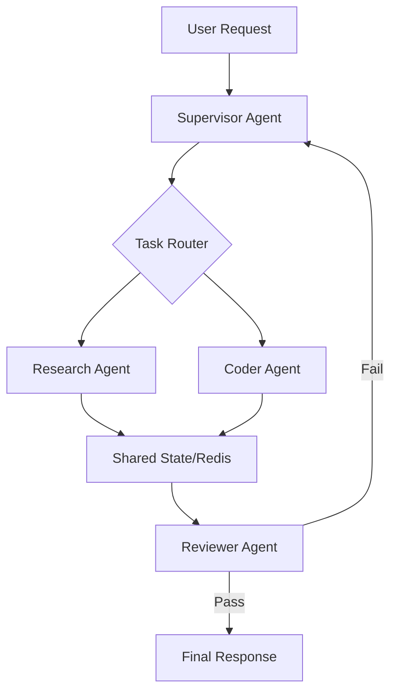

# The Architecture of Scalable AI Multi-Agent Platforms

> A production-grade engineering deep dive into distributed orchestration systems, scalable agent memory, and autonomous infrastructure design.

**Last Updated:** May 11, 2026  
**Author:** Mohammed Zaid Khan  
**Reading Time:** 28 min read  

---

## The Paradigm Shift: Beyond Linear Chains

In the early cycles of LLM integration, "chaining" was the primary abstraction. Developers used tools like LangChain to create linear, predictable sequences: *User Input -> Prompt A -> Output A -> Prompt B -> Final Output*. While effective for "demo-ware" or simple summarization, linear chains fail catastrophically in production environments where tasks are non-deterministic, high-stakes, and require multi-step reasoning with backtracking.

### The Rise of Agentic Workflows
Modern **Multi-Agent Systems (MAS)** replace linear chains with cyclic, state-aware graphs. In this model, agents are treated as specialized microservices. One agent might handle technical research, another generates code, a third performs security auditing, and a fourth acts as the "Supervisor" that manages the global objective. 

However, moving from a single LLM call to a fleet of autonomous agents introduces exponential complexity in state synchronization and cost management. At [Zaid Systems](https://www.zaidsystems.dev), we've found that the bottleneck isn't the LLM's intelligence—it's the orchestration layer's ability to maintain a consistent world-view across a distributed cluster of agents.

---

## The Orchestration Layer: Graphs over Chains

The "Master Orchestrator" is the brain of the platform. Unlike traditional workflow engines (e.g., Airflow), an agentic orchestrator must handle **probabilistic branching**.

### The Supervisor Pattern vs. Peer-to-Peer
We typically implement the **Supervisor Pattern**. A high-reasoning model (like GPT-4o or Claude 3.5 Sonnet) decomposes a goal into a task list and dispatches them to worker agents.

**The Tradeoff:**
- **Supervisor**: Easier to debug, lower chance of infinite loops, but creates a single point of failure and higher latency.
- **P2P**: Lower latency, more emergent behavior, but notoriously difficult to observe and can lead to "agentic deadlock" where agents loop indefinitely.

### Architecture Diagram: The Agentic Loop

---

## Distributed Memory: Short-Term vs. Semantic

An agent is only as good as its context. In a distributed system, memory cannot reside in local process RAM.

### The Three Tiers of Memory:
1.  **Episodic Memory**: The current conversation history. We store this in **Redis** with TTLs.
2.  **Procedural Memory**: The specific set of tools and instructions given to an agent. This is treated as "Code" and versioned in Git.
3.  **Semantic Memory**: Historical knowledge retrieved via RAG. We use **Qdrant** or **pgvector** for high-concurrency retrieval.

**Operational Caveat:** State drift is real. When Agent A updates the shared memory, Agent B might still be operating on a cached version of the context. We implement **Redlock-based distributed locks** to ensure atomic state updates, though this introduces a slight latency penalty that must be factored into the user experience.

---

## The Cost of Autonomy: Operational Realities

Every agentic "turn" costs tokens. A complex multi-agent flow can easily spend $2.00 to $5.00 per request if not optimized.

### Strategies for Cost Control:
- **Model Routing**: We route simple routing or summarization tasks to **Llama-3-8B** or **Mistral-7B**, reserving the $15/1M token models for final reasoning.
- **Prompt Caching**: We utilize Anthropic's prompt caching to reduce costs by 50-80% for long system instructions that remain static across the loop.

---

## Contrarian Thinking: Is More Autonomy Better?

The industry is currently obsessed with "Fully Autonomous Agents." However, in our experience building for enterprise clients, **constrained autonomy** delivers significantly better ROI.

An agent that can "do anything" usually does nothing well. We prefer **Directed Acyclic Graphs (DAGs) with agentic nodes**. This provides the reliability of traditional software with the reasoning power of AI where it's actually needed.

> **Rule of Thumb:** If a process can be written as a deterministic script, don't use an agent. Save the agents for the "fuzzy" logic between the scripts.

---

## Technical FAQ

### How do you handle infinite loops?
We implement a hard `max_turns` limit (typically 15-20) and a "Circuit Breaker" agent that monitors the global state for repetitive patterns. If an agent repeats the same tool call three times with the same error, the workflow is escalated to a human.

### Why not use LangChain?
LangChain is excellent for prototyping. However, for production-grade, high-concurrency systems, we often find its abstractions too heavy. We prefer building custom orchestration using **FastAPI**, **Redis**, and **Rust-based worker agents** to maintain sub-millisecond overhead in the orchestration layer itself.

---

## Further Reading
- [The Case for Agentic Workflows - Andrew Ng](https://www.deeplearning.ai/)
- [Distributed Systems: Principles and Paradigms - Tanenbaum](https://www.distributed-systems.net/)
- [REPL-based Agent Environments - Research Paper](https://arxiv.org/abs/2303.17581)

---

### About the Author
**Mohammed Zaid Khan** is an AI Systems Developer and founder of **Zaid Systems**. He specializes in engineering high-throughput distributed architectures, autonomous agent orchestration, and production-grade intelligent infrastructure. Connect on [LinkedIn](https://linkedin.com/in/khanmohammedzaid) or [GitHub](https://github.com/mrbilauta).
